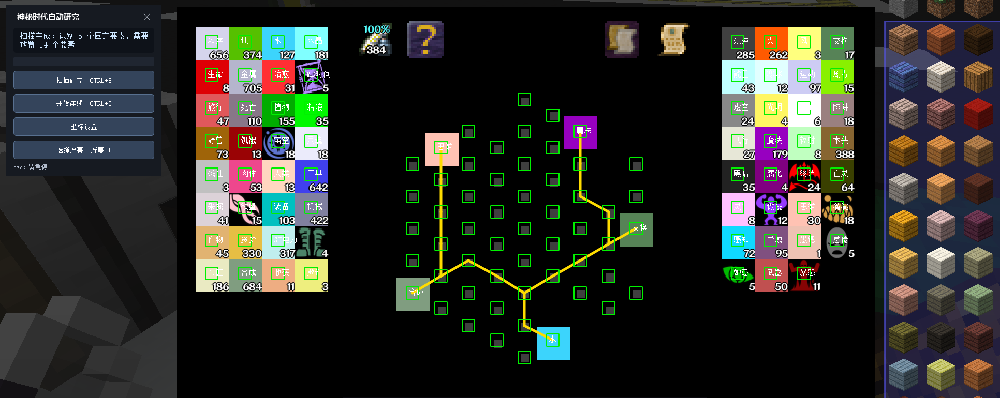
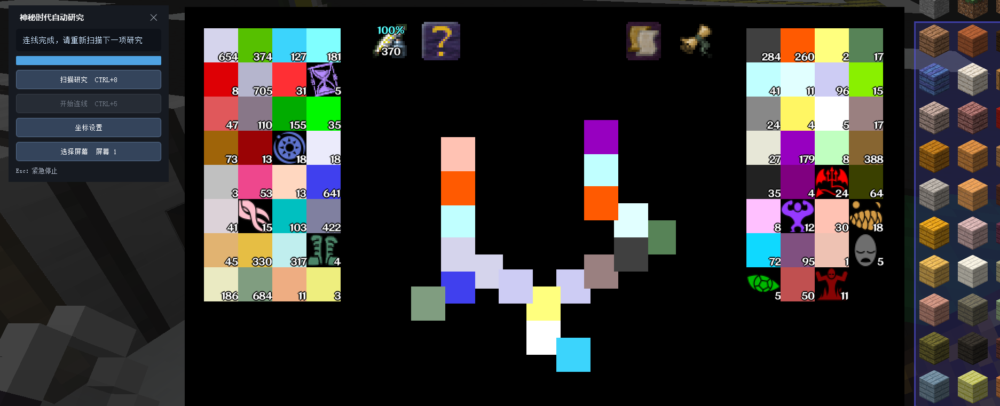

# Auto Thaumcraft Research GUI

适用于《神秘时代 4》研究界面的自动连线工具，提供可拖动控制面板、图像自动标定、研究扫描、方案预览、自动拖动、Esc 紧急停止和多屏支持。

> 本项目基于 Silvia 的原项目 [2824799/auto_thaumcraft_research](https://github.com/2824799/auto_thaumcraft_research) 开发。感谢原作者提供元素识别数据、合成关系、材质包和自动研究的初始实现。

## 效果展示





## 使用方法

1. 将 `auto_thaumcraft_research.zip` 放入 Minecraft 的 `resourcepacks` 文件夹并启用。
2. 双击 Release 中的 `AutoThaumcraftResearch-v1.1.1.exe` 启动程序。
3. 多屏环境下先点击“选择屏幕”，选择 Minecraft 所在屏幕。
4. 打开研究界面，进入“坐标设置”。
5. 点击“拖动红框选择工作区域”，让红框覆盖完整研究盘和左右元素列表，松开鼠标确认。
6. 点击“自动标定并预览绿框”。程序会从当前画面定位研究格和元素；确认绿框位置正确后保存。
7. 点击“扫描研究”或按 `Ctrl + 8`，确认黄色连接方案后点击“开始连线”或按 `Ctrl + 5`。
8. 自动连线期间可随时按 `Esc` 紧急停止。停止后需要重新扫描。

工作区域记录在 EXE 同目录的 `calibration.json` 中。研究格和元素位置不会写成固定坐标，而是在每次扫描时根据画面重新识别，因此元素列表增加或排序变化后，已有元素仍可正确定位。原料列表的行数以及当前 GUI 缩放后的格子尺寸也会自动推导，不限定为 11 行或 13 行。

## 自动标定说明

- 红色虚线框：用户限定的截图和识别范围。
- 绿色方框：本次自动识别出的研究格和元素位置。
- 黄色连线：程序计算出的放置方案。
- 控制面板、设置窗口和预览层会在截图及自动拖动前隐藏，不会遮挡识别区域或接收拖动点击。

新加入但尚未收录颜色和配方的元素会被跳过，不会导致后续已有元素的位置整体错位。若连接方案必须使用该新元素，仍需先在 `ys.txt`、`class.txt` 和元素配方数据中补充它。

## 常见问题

### 显示“扫描失败”或“未识别到元素列表”

- 确认专用材质包已经启用。
- 确认研究界面完整可见，没有被其他窗口遮挡。
- 重新拖动红框，覆盖研究盘和左右两侧元素列表。
- 在“坐标设置”中运行自动标定，先检查绿色方框是否正确。

### 多屏环境拖动位置不正确

先选择 Minecraft 所在屏幕，再重新选择工作区域和自动标定。工作区域坐标始终相对于当前所选屏幕。

## 从源码运行

```powershell
python -m pip install -r requirements.txt
python main.py
```

运行 `build_exe.bat` 可使用 PyInstaller 生成 `dist/AutoThaumcraftResearch-v1.1.1.exe`。

## 许可与致谢

本项目沿用仓库中的 MIT License。原始实现与数据来自 [2824799/auto_thaumcraft_research](https://github.com/2824799/auto_thaumcraft_research)。
